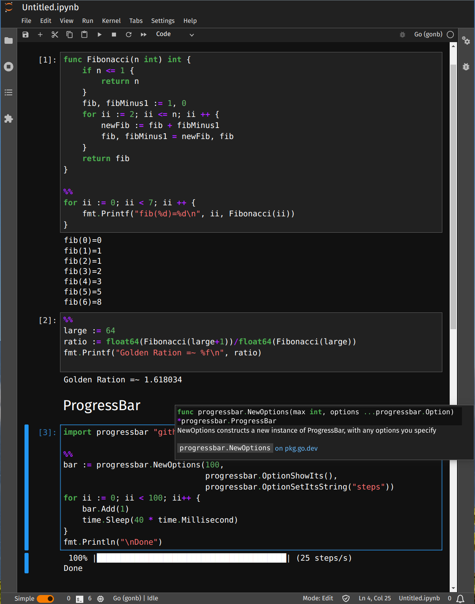

# GoNB, A Go Kernel for Jupyter Notebooks

[](https://pkg.go.dev/github.com/janpfeifer/gonb?tab=doc)
[](https://github.com/Kwynto/gosession/blob/master/LICENSE)
[](https://goreportcard.com/report/github.com/janpfeifer/gonb)
[](https://mybinder.org/v2/gh/janpfeifer/gonb/HEAD?labpath=examples%2Ftutorial.ipynb)
[](https://github.com/janpfeifer/gonb/actions/workflows/go.yaml)


## For a quick start, see the [**tutorial**](examples/tutorial.ipynb)!

## Highlights:

* Auto-complete and contextual help while coding.
* Rich content display: HTML, images, javascript, svg, videos, etc.
* Uses standard Go compiler: 100% compatibility with projects, even those using CGO.
  It also supports arbitrary Go compilation flags to be used when executing the cells.
* Faster execution than interpreted Go, used in other similar kernels -- the cost of imperceptible increased 
  start up, since each cell is compiled.
* Support for `go.mod` and `go.work`, to allow local development. Including importing specific versions of libraries.
* Several handy special commands, see `%help`.
* Shell command executions with `!` -- handy at times, for instance to install packages.
* Reported to work with Github Codespace, VSCode, Binder, Google's Colab, etc.
* Very well documented and supported.
* Great for data-science, testing, writing reports, live demos, etc.
* Includes a [pre-built docker](https://hub.docker.com/r/janpfeifer/gonb_jupyterlab), that includes JupyterLab and GoNB, that can be used to easily try it out.




### Example of animating a plot


## Introduction

Go is a compiled language, but with very fast compilation, that allows one to use
it in a REPL (Read-Eval-Print-Loop) fashion, by inserting a "Compile" step in the middle
of the loop -- so it's a Read-Compile-Run-Print-Loop — while still feeling very interactive. 

**GoNB** leverages that compilation speed to implement a full-featured (at least it's getting there)
[Jupyter notebook](https://jupyter.org/) kernel.
As a side benefit it works with packages that use CGO — although it won't parse C code in the cells,
so it can't be used as a C kernel.

It already includes many goodies: cache between cell of results, contextual help and auto-complete (with 
[`gopls`](https://github.com/golang/tools/tree/master/gopls)),
compilation error context (by mousing over), bash command execution, images, html, etc.
See the [tutorial](examples/tutorial.ipynb).

It's been heavily used by the author (in developing [GoMLX](https://github.com/gomlx/gomlx), a machine 
learning framework for Go), but should still be seen as **experimental** — if we hear success stories
from others, we can change this.

Reports of issues as well as fixes are always welcome.

There is also
[a live version in Google's Colab](https://colab.research.google.com/drive/1vUd3SSoOm2K6UQLnkJQursZZx4CaIT_1?usp=sharing)
that one can interact with (make a copy first) — if the link doesn't work (Google Drive sharing publicly
is odd), [download it from GitHub](examples/google_colab_demo.ipynb) and upload it to Google's Colab.

# Installation

**Only for Linux and macOS. In Windows, it works in WSL or inside a Docker**


## Docker

GoNB offers a [pre-built docker](https://hub.docker.com/r/janpfeifer/gonb_jupyterlab), 
that includes JupyterLab and GoNB. 
To use it, go to a directory that you want to make available to the Jupyter notebook 
(your home directory, or a directory where to store the notebook files).
It will be mounted on the `work/` subdirectory in JupyterLab.

To start it:

```shell
docker pull janpfeifer/gonb_jupyterlab:latest
docker run -it --rm -p 8888:8888 -v "${PWD}":/home/jovyan/work janpfeifer/gonb_jupyterlab:latest
```

Then copy&paste the URL that it outputs in your browser.


## Linux and macOS installation

You need to install (if not yet there), **GoNB**, `goimports` and `gopls` (for auto-complete), and then run 
`gonb --install`. 

```bash
go install github.com/janpfeifer/gonb@latest && \
  go install golang.org/x/tools/cmd/goimports@latest && \
  go install golang.org/x/tools/gopls@latest && \
  gonb --install
```

And then (re-)start Jupyter (if it is already running).

In GitHub's Codespace, if Jupyter is already started, restart the docker — it will also restart Jupyter.

**Note**: for `go.work` to be parsed correctly for auto-complete, you need `gopls` version greater or equal 
to v0.12.4 (or at least `v0.12.0`?).
You can check it with `gopls version`.

## Windows

The recommendation is to use [WSL (Windows Subsystem for Linux)](https://learn.microsoft.com/en-us/windows/wsl/install)
or WSL2, and run Jupyter and the GoNB kernel in the Linux/WSL environment. 
Install there as if it were in a linux machine.

A pure Windows installation is not supported at this time — but contributions to add support for it would be welcome :)


# Rich display: HTML, Images, SVG, Videos, manipulating javascript, etc.

**GoNB** opens a named pipe (set in environment variable `GONB_PIPE`) that a program can use to directly
display any type of HTML content. 

For the most cases, one can simply import 
[`github.com/janpfeifer/gonb/gonbui`](https://pkg.go.dev/github.com/janpfeifer/gonb/gonbui):
the library offers a convenient API to everything available. Examples of use in the
[tutorial](examples/tutorial.ipynb). 

If implementing some new mime type (or some other form of interaction), see `kernel/display.go` for the protocol
details.

# FAQ

* What is the `%%` symbol seen everywhere?
  * It is a special commands for *GoNB* that means "insert a `func main {...}` here".
    There are many other special commands, see `%help` for the complete list, 
    or check out the [**tutorial**](examples/tutorial.ipynb).

# TODOs

Contributions are welcome! 

* Windows version: 
  * Installation.
  * Named-pipe implementation in `kernel/pipeexec.go`.
* Create a JupyterLab extension to allow the Go code to create and interact with widgets. 
  Alternatively, open a WebSocket from the widget to the kernel.
  Some links:
  * https://github.com/jupyterlab/extension-examples
  * https://jupyter-notebook.readthedocs.io/en/4.x/comms.html
  * https://jupyter-client.readthedocs.io/en/latest/api/jupyter_client.asynchronous.html#jupyter_client.asynchronous.client.AsyncKernelClient.comm_info
  * https://discourse.jupyter.org/c/jupyterlab/extensions/43

# Implementation

The Jupyter kernel started from [gophernotes](https://github.com/gopherdata/gophernotes)
implementation, but was heavily modified and little from it is left. Also, the
execution loop and mechanisms are completely different and new: GoNB compiles and 
executes on-the-fly, instead of using a REPL engine.
