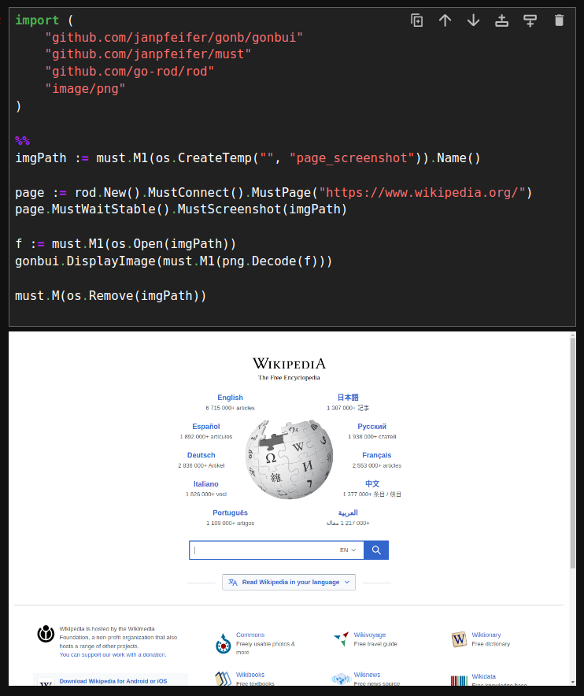

# GoNB, A Modern Go Kernel for Jupyter Notebooks

[](https://pkg.go.dev/github.com/janpfeifer/gonb?tab=doc)
[](https://github.com/Kwynto/gosession/blob/master/LICENSE)
[](https://goreportcard.com/report/github.com/janpfeifer/gonb)
[](https://mybinder.org/v2/gh/janpfeifer/gonb/HEAD?labpath=examples%2Ftutorial.ipynb)
[](https://github.com/janpfeifer/gonb/actions/workflows/go.yaml)


## For a quick start, see the [**tutorial**](examples/tutorial.ipynb)!

## Highlights:


* **NEW**: Now supported by [Jupytext](https://github.com/mwouts/jupytext): it allows one to write the notebook as a normal.
  Go file, and use [Jupytext](https://github.com/mwouts/jupytext) to convert to a notebook (with markdown support, etc). 
  See [example](https://github.com/mwouts/jupytext/issues/1244#issuecomment-2202097837).
* Auto-complete and contextual help while coding.
* Rich content display: HTML, markdown (with latex), images, javascript, svg, videos, etc.
  * Widgets (sliders, buttons) support: interact using HTML elements. Create your own widgets!
  * [Plotly integration](https://plotly.com/javascript/) using [go-plotly](https://github.com/MetalBlueberry/go-plotly) (see example in [tutorial](examples/tutorial.ipynb))
  * [Apache ECharts](https://echarts.apache.org/en/index.html) integration using [gonb-echarts](https://github.com/janpfeifer/gonb-echarts) and [go-echarts](https://github.com/go-echarts/go-echarts): see [examples](https://janpfeifer.github.io/gonb-echarts/)
* Uses standard Go compiler: 100% compatibility with projects, even those using CGO.
  It also supports arbitrary Go compilation flags to be used when executing the cells.
* Faster execution than interpreted Go, used in other similar kernels -- at the cost of imperceptible increased 
  start up, since each cell is compiled.
* Run cell's `Test*` and `Benchmark*` functions with `go test`, simply adding `%test` to cell.
* Support for `go.mod` and `go.work`, to allow local development. Including importing specific versions of libraries.
* Debug using [gdlv](https://github.com/aarzilli/gdlv), a GUI for the [delve](https://github.com/go-delve/delve) debugger (see %help).
* Shell command executions with `!` -- handy at times, for instance to install packages.
* Reported to work with Github Codespace, [VSCode](docs/VSCode.md), Binder, Google's Colab, etc.
* Very well documented and supported.
* Great for data-science, testing, writing reports, live demos, etc.
* Includes a [pre-built docker](https://hub.docker.com/r/janpfeifer/gonb_jupyterlab), that includes JupyterLab and GoNB, that can be used to easily try it out. Alternatively, there is a [Google's Colab](https://colab.research.google.com/drive/1vUd3SSoOm2K6UQLnkJQursZZx4CaIT_1?usp=sharing), that bootstraps **GoNB** and can be used online.
* Online help and much more, see `%help`.
* Compile and execute the Go code as WASM: allows one to do interactive widgets in notebooks. See `%wasm` (EXPERIMENTAL).

## Examples:

### Auto-complete and Contextual Help


### [Flowers Diffusion Model Demo](https://github.com/gomlx/gomlx/blob/main/examples/oxfordflowers102/OxfordFlowers102_Diffusion.ipynb)

https://github.com/janpfeifer/gonb/assets/7460115/f1187dad-4c10-4d21-a73e-9090019680ae

### Sine Plot Connected to Slider
(See full code in the [**tutorial**](examples/tutorial.ipynb))


### Example Screenshotting Wikipedia



## Introduction

Go is a compiled language, but with very fast compilation, that allows one to use
it in a REPL (Read-Eval-Print-Loop) fashion, by inserting a "Compile" step in the middle
of the loop -- so it's a Read-Compile-Run-Print-Loop — while still feeling very interactive. 

**GoNB** leverages that compilation speed to implement a full-featured (at least it's getting there)
[Jupyter notebook](https://jupyter.org/) kernel.
As a side benefit it works with packages that use CGO — although it won't parse C code in the cells,
so it can't be used as a C kernel.

It already includes many goodies: cache between cell of results, contextual help and auto-complete (with 
[`gopls`](https://github.com/golang/tools/tree/master/gopls)),
compilation error context (by mousing over), bash command execution, images, html, etc.
See the [tutorial](examples/tutorial.ipynb).

It's been heavily used by the author (in developing [GoMLX](https://github.com/gomlx/gomlx), a machine 
learning framework for Go), but should still be seen as **experimental** — if we hear success stories
from others, we can change this.

Reports of issues as well as fixes are always welcome.

There is also
[a live version in Google's Colab](https://colab.research.google.com/drive/1vUd3SSoOm2K6UQLnkJQursZZx4CaIT_1?usp=sharing)
that one can interact with (make a copy first) — if the link doesn't work (Google Drive sharing publicly
is odd), [download it from GitHub](examples/google_colab_demo.ipynb) and upload it to Google's Colab.

Finally, because it's compiled and not intepreted, it has a slightly different "semantic" than the Python kernels.
It's highly recommended quickly browsing through the [**tutorial**](examples/tutorial.ipynb).

## Installation

**Only for Linux and macOS. In Windows, it works in WSL or inside a Docker**


### Docker

GoNB offers a [pre-built docker](https://hub.docker.com/r/janpfeifer/gonb_jupyterlab), 
that includes JupyterLab and GoNB. 
To use it, go to a directory that you want to make available to the Jupyter notebook 
(your home directory, or a directory where to store the notebook files).
It will be mounted on the `host/` subdirectory in JupyterLab.

To start it:

```shell
docker pull janpfeifer/gonb_jupyterlab:latest
docker run -it --rm -p 8888:8888 -v "${PWD}":/notebooks/host janpfeifer/gonb_jupyterlab:latest
```

Then copy&paste the URL that it outputs in your browser.


### Linux and macOS Installation Using Standard Go Tools

The [official tutorial on how to install go programs here](https://go.dev/doc/tutorial/compile-install) --
it is pretty simple, go maintains a `GOBIN` directory (that you can set) and `go install` will compile
programs and put it there. You should add the `GOBIN` directory to your `PATH` (the default list of directories
to search for executables).

You need to install (if not yet there), **GoNB**, `goimports` and `gopls` (for auto-complete), and then run 
`gonb --install`. To install them in your `GOBIN` directory:

```bash
go install github.com/janpfeifer/gonb@latest && \
  go install golang.org/x/tools/cmd/goimports@latest && \
  go install golang.org/x/tools/gopls@latest
```

And if `GOBIN` is in your `PATH`, run the following to install **GoNB** as a kernel in the Jupyter configuration
(works for both JupyterLab and Jupyter Notebook).

```bash
gonb --install
```

And then (re-)start Jupyter (if it is already running).

In GitHub's Codespace, if Jupyter is already started, restart the docker — it will also restart Jupyter.

**Note**: for `go.work` to be parsed correctly for auto-complete, you need `gopls` version greater or equal 
to v0.12.4 (or at least `v0.12.0`?).
You can check it with `gopls version`.

### Windows

The recommendation is to use [WSL (Windows Subsystem for Linux)](https://learn.microsoft.com/en-us/windows/wsl/install)
or WSL2, and run Jupyter and the GoNB kernel in the Linux/WSL environment. 
Install there as if it were in a linux machine.

A pure Windows installation is not supported at this time — but contributions to add support for it would be welcome :)

## FAQ

* Is there are reference documentation ?
  * There is a help (run `%help` in a cell) and a [**tutorial**](examples/tutorial.ipynb), which is kept up-to-date and
    is comprehensive -- it includes every GoNB feature.
  * The libraries that are used or UI, Widgets and manipulating the DOM in the notebook's browser, are all under the package `gonbui`.
    They are described in the [**tutorial**](examples/tutorial.ipynb), but also documented in [pkg.go.dev](https://pkg.go.dev/github.com/janpfeifer/gonb/gonbui?tab=doc).
* What is the `%%` symbol seen everywhere?
  * It is a special commands for *GoNB* that means "insert a `func main {...}` here".
* Go error handling is verbose and annoying for things interactive as a notebook. Can we do something ?
  * Yes! Error handling for small scripts in a notebook can get in the way at times. There are various
    solutions to this. Often folks create a series of `Must()` functions, or simply use
    [this trivial `must` package](https://github.com/janpfeifer/must).

## TODOs

Contributions are welcome! 

* Windows version: 
  * Installation.
  * Named-pipe implementation in `kernel/pipeexec.go`.

## Thanks

* [Go](golang.org)
* [Jupyter](https://jupyter.org/), what an awesome project.
* [gophernotes](https://github.com/gopherdata/gophernotes), from which this is a highly modified fork, little from the original code exists.
* The Go gopher logo (`internal/kernel`) used in the installation of the Jupyter kernel was designed by Renee French
  (http://reneefrench.blogspot.com/), see Creative Commons 3.0 Attributions license in
  [Wikimedia](https://commons.wikimedia.org/wiki/File:Go_gopher_favicon.svg).

## Contributing

Contributions are very welcome. The code is generally well documented -- not always, but mostly. There are a also a couple of guides worth reading if contributing in the [`docs/`](https://github.com/janpfeifer/gonb/tree/main/docs) subdirectory.

There are two parts of the project:

1. The kernel itself: that builds the binary package. Most subpackages are under `internal/`.
2. The UI library in the packages under `github.com/janpfeifer/gonb/gonbui`.

## Star History

[](https://star-history.com/#janpfeifer/gonb&Date)
