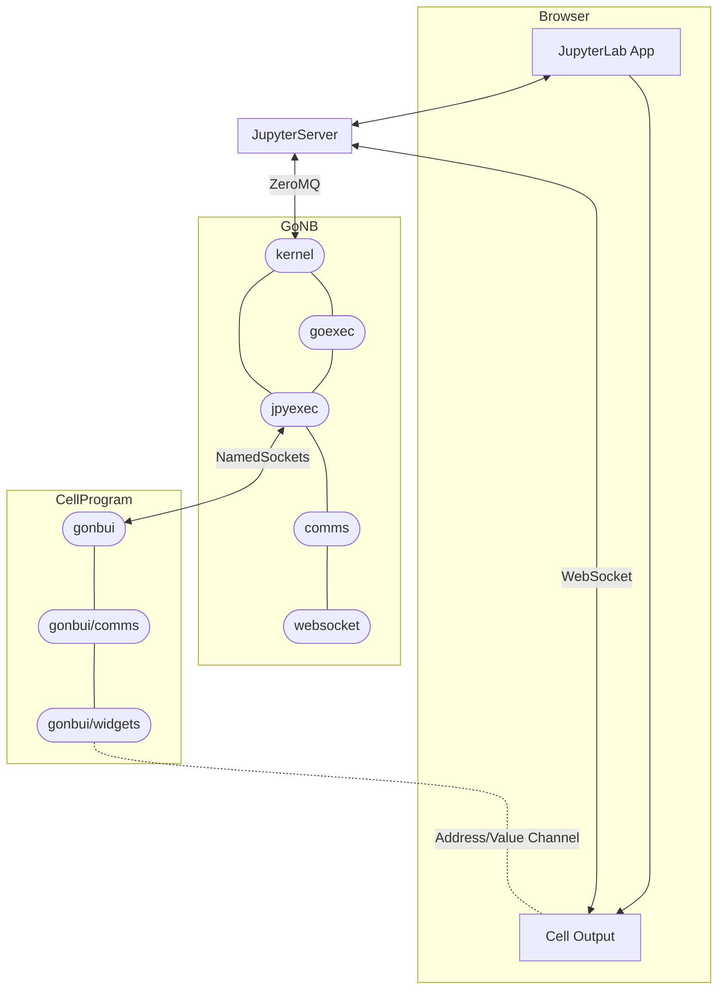

# "Front-End Communication" or "Enabling Interactive Widgets"

The communication from the front-end (browser displaying output of cell execution) to the actual
executing program (the Go program typed in by the user in the cells) has a straightforward API
(based on "sending/receiving values to addresses"), but it's implementation uses many hoops,
and may be very difficult to debug/fix if something changes.

This document tries to describe what is going on: (1) The final API offered to the users; (2) The various
modules (in Go and Javascript) implemented by **GoNB** to support the API. 
It doesn't go into the details of what goes on inside the various Jupyter modules, but in the end
of the document it includes links to various relevant Jupyter docs.

## API for Widgets Implementations and End-user

The API allows one to send / receive values associated to addresses:

* **Address**: Simply a string, but we add a few conventions on top:
  * Addresses starting with "#" are private to the protocol implementation, please don't
    use these (except if you are doing internal GoNB development).
  * Addresses use a hierarchical structure, using "/" as separator, as paths in a (unix) filesystem.
  * Examples used by default by current widgets: `"/button/" + gonbui.UniqueId()`, `"/slider/" + gonbui.UniqueId()`.
* **Value**: Supported types: `float64`, `int`, `string` (with automatic conversion in Go if the
  JSON parser uses something different). Planned future support: (1) map of string to a *Value* type 
  (`map[string]any`); (2) slices of a *Value* type (`[]any`). The API uses generics to support
  these basic types.

### Go Code (Cell code)

#### Send a value to an address

```go
import "github.com/janpfeifer/gonb/gonbui/comms"

…
   comms.Send("/my/component". 3.1415)
```

#### Listen to an address

Using the subscription API:

```go
import "github.com/janpfeifer/gonb/gonbui/comms"

…
    subId := comms.Subscripe("/my/counter", func (address string, value int) {
		fmt.Printf("counter=%d\n", value)
		if value > 10 {
			// Stop listening when counter reaches 10.
			comms.Unsubscribe(subId)
        }
    })
```

Or using an `AddressChannel[T]`:

```go
  counterChan := comms.Listen[int]("/my/counter")
  for value := range counterChan.C {  // Actual channel in `.C`
    fmt.Printf("counter=%d\n", value)
    if value > 10 {
        // Stop listening when counter reaches 10.
        break
    }
  }
  counterChan.Close()
```

### Front-End Javascript Code (Running in browser by widgets implementations)

#### Installing `gonb_comm` object in browser

The javascript code is "injected" in the browser by the usual means: Jupyter allows one to
send HTML code (and many other MIME types) to be "displayed" in the cell output. 
If one sends Javascript (or HTML with an embeded `<script>` element) it gets executed. 
See `gonbui/dom` package's `TransientJavascript(js string)` (called from a cell) for a convenient
way to execute arbitrary Javascript.
Or the (still experimental) `%wasm` to run WebAssembly instead.

GoNB injects the `gonb_comm` Javacript object when the user uses the `%widgets` special command,
or at the first use of the `gonb/gonbui/comms` package. 

#### API

The `gonb_comm` global object (`globalThis.gonb_comm`) provides the following methods:

1. `send(address, value)`: sends the value to the given address. The function returns immediately (not a promise), but
   the actual delivery happens asynchronously -- meaning when `gonb_comm.send()` returns the message may not yet have
   been delivered.
2. `subscribe(address, callback) -> Symbol`: subscribes to any incoming values send to the given address. It returns
   a `Symbol` (an id) that can be used to unsubscribe later. There are no limits to the number of subscribers to an
   address.
3. `unsubscribe(Symbol)`: unsubscribe from previous subscription to an address. It takes the `Symbol` (an id) returned
   by `gonb_comm.subscribe()`.
4. `close()`: this destroys the `gonb_comm` and breaks the connection with **GoNB** and the program it executes.
   No need to be used by user program or widgets, but just in case one needs it to debug something. One can recreate
   a new `gonb_comm` by the usual means (see previous section).
5. `newSyncedVariable(address, initial_value)`: creates a `SyncedVariable` that can be `set`, `get` or subscribed to
   changes and is associated to an address. It automatically communicates changes (on `set`) to `GoNB` and store results
   of incoming values send to address. Just a small convenience around the `gonb_comm` API.
   
#### Example 1: "Button" Javascript implementation:

The `widgets.Button` (in Go) widget uses the following Javascript to communicate the button clicks:

```js
(() => {
    let gonb_comm = globalThis?.gonb_comm;
    if (!gonb_comm) {
        console.error("Communication to GoNB not setup, button will not synchronize with program.")
        return;
    }
    let buttonCount = gonb_comm.newSyncedVariable("{{.Address}}", 0);
    const button = document.getElementById("{{.HtmlId}}");
    button.addEventListener("click", function() {
        buttonCount.set(buttonCount.get() + 1);
    });
})();
```

Notice this is the code sent to execute in the client. It's a template actually, so `{{.Address}}` is
replaced in Go by the address that is going to be used by the button instance, and `{{.HtmlId}}` is
the unique id of the `<button>` html element being controlled.

#### Example 2: "Slider" Javascript implementation:

This example allows the Go program to update the value of the slider, so updates go both ways. 
Otherwise, same observations as in the Example 1.

```js
(() => {
    let gonb_comm = globalThis?.gonb_comm;
    if (!gonb_comm) {
        console.error("Communication to GoNB not setup, slider will not synchronize with program.")
        return;
    }
    const slider = document.getElementById("{{.HtmlId}}");
    let sliderValue = gonb_comm.newSyncedVariable("{{.Address}}", slider.value);
    slider.addEventListener("change", function() {
        slider.setAttribute("value", slider.value);  // Makes value available when reading `outerHTML`.
        sliderValue.set(slider.value);
    });
    sliderValue.subscribe((value) => {
        slider.value = value;
        slider.setAttribute("value", slider.value); // Makes value available when reading `outerHTML`.
    })
})();
```


## Implementation of Communication

The "behind the scenes" is pretty complex. A summary (as far as my understanding goes) is described 
by the diagram below. 
Details on each element of the diagram are given bellow.



* **JupyterLab App**: the javascript that runs JupyterLab. There is no easy direct access to
  its connections (nothing I could find probing using the browser console). It is responsible
  though to display "rich" content (with different MIME types) from the front-end.
  We leverage that to display HTML and embed Javascript snippets to be executed for the program
  to control the widgets or modify the output.
* **Cell Output**: There are different `<div>` for each cell execution. If used, there are a couple
  for the textual outputs of `stdout` and `stderr`.
  Each call to `gonbui.DisplayHtml` will eventually trigger the creation of a new `<div>` (id is 
  not known by the program) by JupyterLab, which will contain the html code sent by the user.
  There is also `gonbui.UpdateHtml` that updates the content of a `<div>` (or create it the
  first time), we call this "transient" cell output. We use a transient space to inject javascript
  code to be executed, including the `gonb_comm` described in the previous section. The `gonb_comm`
  installation involves opening a `WebSocket` with the `JupyterServer`, which can be used to
  send and receive messages in the "ZeroMQ" network (a communications framework used by Jupyter),
  using the ["Custom Messages" messages of Jupyter protocol](https://jupyter-client.readthedocs.io/en/latest/messaging.html#custom-messages).
* [**Jupyter Server**](https://jupyter-server.readthedocs.io/en/latest/): backend process that serves 
  the JupyterLab app, APIs and Rest end points. It executes and manages the kernel and route the
  ZeroMQ messages (I think).
* **GoNB**, Go kernel, executed once per notebook being edited. Within it, some of the Go internal packages
  of interest are:
  * `kernel` (and `dispatcher`): Handles the communication with the **JupyterServer** using ZeroMQ. It
    will route the "custom messages" to/from the `comms` package.
  * `goexec`: package responsible to build the Go program from a cells content to execute (among many
    other details). It uses `jpyexec` to execute the built program.
  * `jpyexec`: executes any program (usually the compiled cell code) and redirects `stdout` and `stderr`
    to JupyterServer requests to be displayed as a cell output. It also creates two named pipes (one
    in each direction) that the program may optionally open (their path is exported in `$GONB_PIPE` 
    and `$GONB_BACK_PIPE`) to send rich data content (html, images, etc.) or to communicate
    with the front-end. The `jpyexec.Executor` routes those messages to the `comms` package.
  * `comms`: the internal `comms` package bridges the ZeroMQ protocol with the named pipe simple
    protocol with the cell program. It is also responsible to keep state about the front-end
    `gonb_comm` Javascript object being alive and connected, and if not, install it using `websocket`
    package. Not to be mixed up with the `gonbui/comms` package, that communicates from the
    cell program side.
  * `websocket`: serves the Javascript code to create the `gonb_comm` object in the front-end. See
    the file `websocket.js` with the Javascript template.
* **Cell Program**: This is the Go program created by **GoNB** using the user's cell contents in the notebook, and
  executed (typically with control+enter). **GoNB** merges the code of all the cells and dynamically
  creates a `main.go`, then executes `go imports` and `go get` (tooling to auto-import packages), and finally
  executes it (see `jpyexec` for that). It's optional, but if the user's wants to communicate with the front-end
  (as opposed to simply use `stdout`, `stderr`), then they need to use the following public package:
  * `gonbui`: public package that offers rich data output (`DisplayHtml`, `DisplayMarkdown`, images, etc.). It
    includes the code used to communicate with the named pipes in **GoNB** (see `jpyexec` above). 
  * `gonbui/comms`: this package creates the easy "address/value" end-to-end protocol described in 
    the first section. Use uses `gonbui` to talk to the named pipes. Most users won't use this
    package directly, but most widgets implementation will.
  * `gonbui/widgets`: so far only `Button` and `Slider`, it uses `gonbui/comms` to synchronize
    its state with the front-end elements.

## Other concerns for development

There is lots of moving parts, concurrency, and mutexes to attempt to serialize access to resources.
It's not trivial, and likely there are bugs -- very hard to anticipate the exponential combination
of states that can exist, as usual with concurrency. Below I list some of the concerns taken
during design and implementation:

* Messages from **JupyterServer** can be sent or arrive asynchronously using ZeroMQ. In **GoNB**
  they are handled in separate goroutines.
* Messages to/from the named pipes (between **GoNB** and the cell program) are sequential, but
  in GoNB they are also handled in separate goroutines, since some may require communication
  with the front-end. 
* Internal messages: 
  * `#open`/`#open_ack`: opening the "custom messages" communication and closing it);
  * `#start` (sent from cell program to **GoNB** to request the start of communications, meaning 
    installing the `gonb_comm` Javascript object);
  * `#gonbui/sync` and `#gonbui/sync_ack` to make sure any pending rich data (html or some javascript)
    has actually been delivered to the front-end often used at the end of the program, not to 
    finish the execution until everything has been displayed.
  * `#heartbeat/ping` and `#heartbeat/pong`: used between the front-end and **GoNB** to check the
    sated of the connection.
* Recovery: the following scenarios happen relatively often, and the whole system have to be robust 
  in handling them:
  * Restart of the kernel: old `gonb_comm` connection becomes invalid, and if communications are 
    needed (when executing a cell), it needs to transparently destroy it and create a new one.
  * Restart of JupyterServer: if the user "Control+C" the command line that started it for instance.
    This entails a restart of the kernel, but a previous `gonb_comm` WebSocket connection will be
    closed, so there are some details that are different. Should also be tested.
  * Reload of the page: `gonb_comm` is destroyed, but kernel is still alive. Internally the kernel
    will have to recognize the situation, destroy the previous connection state, and install 
    `gonb_comm` again. Similar if the notebook is closed and opened in another browser (another
    computer), the kernel stays alive and is reused.
* JupyterServer saving of the cell output: this is tricky, especially if we send Javascript
  to the frond-end (with the `gonb_comm` code for example), we don't want JupyterServer to save
  this content: if we export the HTML of the page, we don't want the HTML version of the page
  to try to open a WebSocket. Also, if the browser page is reloaded, serving the notebook again
  we don't want the old javascript code to be executed. For this reason most of the code uses
  a transient cell output for Javascript execution, and as soon as we get confirmation of the
  execution (see `gonbui.Sync()`) we overwrite the transient cell output with an empty string.
* Widgets may alter HTML content and JupyterServe doesn't have that information: the opposite 
  problem then the one before. To solve this we provide `gonbui/dom.Persist()`, which will
  take the `innerHTML` of a transient output cell (with the content we want to save), 
  erase the transient output cell, and re-display the html in a normal cell output, through
  JupyterServer. This way the content is properly saved. 

Lots of details, if you are interested and have any questions feel free to ask!

## Relevant Links for Maintainer of the Library

Bits and pieces of information I gathered while researching how to implement this.

1. [Jupyter ZeroMQ messaging protocol](https://jupyter-client.readthedocs.io/en/latest/messaging.html):
   Used to communicate between the _JupyterServer_, the Jupyter WebApp (in the browser) and the 
   Kernel (GoNB).
   a. [Custom Messages](https://jupyter-client.readthedocs.io/en/latest/messaging.html#custom-messages):
      Sub-protocol in the Jupyter's protocol to allow communication from the Front-End to the kernel.
      It doesn't include the part that communicates from Javascript to the JupyterServer (WebSocket),
      see below. Part of the custom messages protocol is defined is a separate section for
      ["comm_info" messages.](https://jupyter-client.readthedocs.io/en/latest/messaging.html#comm-info).
      Notice that the Kernel (GoNB) uses the `Shell` socket, while the front-end uses the `IOPub`
      socket to communicate (through the WebSocket).
2. [JupyterServer Websocket Protocol](https://jupyter-server.readthedocs.io/en/latest/developers/websocket-protocols.html)
   Defines(?) the communication between Javascript and JupyterServer through a WebSocket. 
   It works as a bridge to Jupyter's ZeroMQ messaging system.
   The doc lacks details on the Javascript side: what is the URL of the socket, can there be more than
   one opened at the same time, etc.
   a. `JupyterKernelId`: unique Id created by Jupyter for each kernel execution (at least it reports that 
      in the logs. GoNB captures this Id by extracting it from the filename of the json file passed to
      it when executing (`--kernel=<file.json>` argument). It can be separated from the file name with 
      a regexp like `^.*/kernel-([a-f0-9-]+).json$`. 
   b. Websocket URL to connect (found out by looking at browser tools): 
      `/api/kernels/<kernel_id>/channels`.

