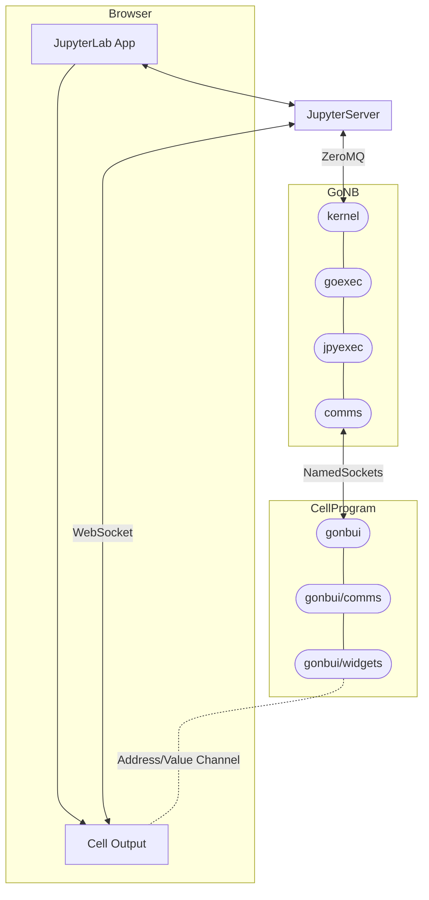

# "Front-End to Go Communication" or "Enabling Interactive Widgets"

The communication from the front-end (browser displaying output of cell execution) to the actual
executing program (the Go program typed in by the user in the cells) has a straightforward API
(based on "sending/receiving values to addresses"), but it's implementation uses many hoops,
and may be very difficult to debug/fix if something changes.

This document tries to describe what is going on: (1) The final API offered to the users; (2) The various
modules (in Go and Javascript) implemented by **GoNB** to support the API. 
It doesn't go into the details of what goes on inside the various Jupyter modules, but in the end
of the document it includes links to various relevant Jupyter docs.

## API for Widgets Implementations and End-user

The API allows one to send / receive values associated to addresses:

* **Address**: Simply a string, but we add a few conventions on top:
  * Addresses starting with "#" are private to the protocol implementation, please don't
    use these (except if you are doing internal GoNB development).
  * Addresses use a hierarchical structure, using "/" as separator, as paths in a (unix) filesystem.
  * Examples used by default by current widgets: `"/button/" + gonbui.UniqueId()`, `"/slider/" + gonbui.UniqueId()`.
* **Value**: Supported types: `float64`, `int`, `string` (with automatic conversion in Go if the
  JSON parser uses something different). Planned future support: (1) map of string to a *Value* type 
  (`map[string]any`); (2) slices of a *Value* type (`[]any`). The API uses generics to support
  these basic types.

### Go Code (Cell code)

#### Send a value to an address

```go
import "github.com/janpfeifer/gonb/gonbui/comms"

…
   comms.Send("/my/component". 3.1415)
```

#### Listen to an address

Using the subscription API:

```go
import "github.com/janpfeifer/gonb/gonbui/comms"

…
    subId := comms.Subscripe("/my/counter", func (address string, value int) {
		fmt.Printf("counter=%d\n", value)
		if value > 10 {
			// Stop listening when counter reaches 10.
			comms.Unsubscribe(subId)
        }
    })
```

Or using an `AddressChannel[T]`:

```go
  counterChan := comms.Listen[int]("/my/counter")
  for value := range counterChan.C {  // Actual channel in `.C`
    fmt.Printf("counter=%d\n", value)
    if value > 10 {
        // Stop listening when counter reaches 10.
        break
    }
  }
  counterChan.Close()
```

### Javascript Code (Running in browser by widgets implementations)

The javascript code is "injected" in the browser by the usual means: Jupyter allows one to
send HTML code (and many other MIME types) to be "displayed" in the cell output. 
If one sends Javascript (or HTML with an embeded `<script>` element) it gets executed. 
See `gonbui/dom` package's `TransientJavascript(js string)` (called from a cell) for a convenient
way to execute arbitrary Javascript.
Or the experimental `%wasm` to run WebAssembly instead.

GoNB injects the `gonb_comm` Javacript object when the user uses the `%widgets` special command,
or at the first use of the `comms` package. so the API below is only available after that.


## Front-End Code Example -- Widget implementation



The `websockets` package serves the javascript (`websocket.js`) that implements an end-to-end message
system between the front-end -- cell outputs in the browser -- to the user's Go code.
The goal is to allow the HTML output in the browser to act not only as a form
of rich output, but also input, interacting with the user's code.

It implements the underlying javascript `WebSocket`, the Jupyter protocol using _custom messages_ (see below), and
on top of that a minimal simpler API in javascript (it can also be used from WASM) to send/receive messages keyed
by an "address key", as well as "synchronized variables", also keyed by an "address key". More details below.

The corresponding kernel side of the protocol is implemented in `gonb/internal/comms`.

The API for exchanging messages with the front-end from the end-user program is available
in `gonb/gonbui/comms`. It uses 2 named pipes opened to talk to the executed cell.

There one can send/receive messages keyed
by an "address key", as well as "synchronized variables", also keyed by an "address key". More details below.

## Examples for End User

### Go Code Example

This is an example of the typical code that would go in a 

### Front-End Code Example -- Widget implementation


### Front-End With WASM Example


## Relevant Links for Maintainer of the Library

Bits and pieces of information I gathered while researching how to implement this.

1. [Jupyter ZeroMQ messaging protocol](https://jupyter-client.readthedocs.io/en/latest/messaging.html):
   Used to communicate between the _JupyterServer_, the Jupyter WebApp (in the browser) and the 
   Kernel (GoNB).
   a. [Custom Messages](https://jupyter-client.readthedocs.io/en/latest/messaging.html#custom-messages):
      Sub-protocol in the Jupyter's protocol to allow communication from the Front-End to the kernel.
      It doesn't include the part that communicates from Javascript to the JupyterServer (WebSocket),
      see below. Part of the custom messages protocol is defined is a separate section for
      ["comm_info" messages.](https://jupyter-client.readthedocs.io/en/latest/messaging.html#comm-info).
      Notice that the Kernel (GoNB) uses the `Shell` socket, while the front-end uses the `IOPub`
      socket to communicate (through the WebSocket).
2. [JupyterServer Websocket Protocol](https://jupyter-server.readthedocs.io/en/latest/developers/websocket-protocols.html)
   Defines(?) the communication between Javascript and JupyterServer through a WebSocket. 
   It works as a bridge to Jupyter's ZeroMQ messaging system.
   The doc lacks details on the Javascript side: what is the URL of the socket, can there be more than
   one opened at the same time, etc.
   a. `JupyterKernelId`: unique Id created by Jupyter for each kernel execution (at least it reports that 
      in the logs. GoNB captures this Id by extracting it from the filename of the json file passed to
      it when executing (`--kernel=<file.json>` argument). It can be separated from the file name with 
      a regexp like `^.*/kernel-([a-f0-9-]+).json$`. 
   b. Websocket URL to connect (found out by looking at browser tools): 
      `/api/kernels/<kernel_id>/channels`.

